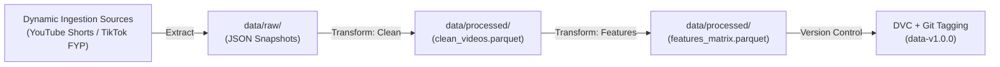

# ViralSense: Social Media Virality Prediction & Trend Saturation Detection Engine

[](https://www.python.org/downloads/release/python-3100/)
[](https://mlflow.org/)
[](https://github.com/features/codespaces)
[](https://opensource.org/licenses/MIT)

ViralSense is an end-to-end MLOps pipeline featuring continual learning capabilities, engineered to forecast early virality scores for short-form video content (YouTube Shorts & TikTok) and identify trend lifecycle stages (early-rise, peak, and saturated). The system addresses real-world constraints such as label latency, concept drift, and API quota limits through an automated, staged machine learning workflow.

---

## Key Objectives & Problem Domain

The lifecycle of short-form digital content is exceptionally brief, often decaying within days or a few weeks before reaching audience fatigue. ViralSense resolves this bottleneck by:
* Predicting content virality early via interaction growth rates (views, likes, comments, shares).
* Classifying trend phases using the slope of virality scores over time.
* Mitigating label latency by isolating immature observations from final evaluation datasets during a 3–7 day maturation window.
* Monitoring covariate shift and concept drift to trigger adaptive model retraining.
* Assisting content creators and digital marketing teams in discovering emerging viral opportunities and optimizing promotional content strategies.

---

## Data Pipeline Architecture

Data is ingested periodically via an automated ETL pipeline, cleaned, feature-engineered, and versioned using DVC prior to consumption by machine learning models.



For complete technical specifications and architectural design, refer to **[docs/data_pipeline_architecture.md](docs/data_pipeline_architecture.md)**.

---

## Directory Structure

This repository adheres to the **Cookiecutter Data Science** standard:

```text
├── .devcontainer/         # GitHub Codespaces container setup and reproducibility config
├── config/                # Pipeline parameter files (config.yaml)
├── data/
│   ├── external/          # Auxiliary trend signals (Google Trends, TikTok trends)
│   ├── processed/         # Cleaned, feature-engineered datasets (Parquet)
│   └── raw/               # Raw batch snapshots extracted from APIs and feeds
│       ├── tiktok/        # TikTok public FYP snapshots
│       └── youtube/       # YouTube Shorts snapshots
├── docs/                  # Technical design and architecture documentation
├── models/                # Serialized model artifacts and experiment weights
├── notebooks/             # Exploratory Data Analysis (EDA) and prototype notebooks
├── src/                   # Production-grade source code
│   ├── __init__.py
│   ├── ingest_data.py     # Unified dynamic data ingestion & periodic simulation script
│   ├── preprocess.py      # Automated preprocessing (tokenization, stopwords, missing values)
│   ├── data/              # Modular data extraction and validation modules
│   │   ├── clean.py       # Data cleaning, deduplication, and schema validation
│   │   ├── ingest_tiktok.py  # TikTok live FYP and trending ingestion
│   │   └── ingest_youtube.py # YouTube Data API v3 and trending ingestion
│   ├── features/          # Tabular metric computation and text vectorization
│   │   └── build_features.py # Velocity, engagement rates, and label generation
│   └── models/            # Staged regression and classification pipelines
├── .env.example           # Template for environment variables and API keys
├── .gitignore             # Standard Python/ML git ignore configuration
├── LICENSE                # Project license (MIT)
├── requirements.txt       # Core project dependencies
└── README.md              # Project documentation
```

---

## Pipeline Execution Guide

### 1. Environment Setup
Install project dependencies and configure environment variables:
```bash
cp .env.example .env
pip install -r requirements.txt
```

### 2. Data Ingestion (Dynamic & Continual Learning Ready)
Ekstraksi data dinamis dijalankan menggunakan modul terpadu `src/ingest_data.py`. Modul ini mendukung penarikan dari **YouTube Shorts** dan **TikTok FYP**, serta menyediakan mekanisme simulasi periodik non-destruktif (*append-only timestamped snapshots*) untuk mendukung konsep **Continual Learning**.

```bash
# 1. Jalankan penarikan tunggal untuk seluruh platform (YouTube Shorts & TikTok)
python src/ingest_data.py --source all

# 2. Jalankan penarikan untuk satu platform spesifik
python src/ingest_data.py --source youtube
python src/ingest_data.py --source tiktok

# 3. Simulasi penarikan periodik (Continual Learning: misal 3 siklus dengan jeda 5 detik)
# Setiap siklus menghasilkan file snapshot JSON baru ber-timestamp tanpa menimpa data lama
python src/ingest_data.py --source all --runs 3 --interval 5
```

**Struktur Snapshot Raw Data:**
* `data/raw/youtube/{YYYY-MM-DD}/youtube_trending_{HHMMSS}.json`
* `data/raw/tiktok/{YYYY-MM-DD}/tiktok_trending_{HHMMSS}.json`
* `data/raw/sample_raw_videos.csv` (ringkasan sampel mentah berformat CSV)

### 3. Automated Preprocessing & NLP Cleaning
Prapemrosesan data mentah dijalankan secara otomatis menggunakan `src/preprocess.py` untuk membersihkan data mentah sebelum masuk ke tahap rekayasa fitur:

```bash
python src/preprocess.py
```

**Tahapan Preprocessing:**
1. **Aggregasi Snapshot**: Membaca seluruh file snapshot mentah dari `data/raw/`.
2. **Missing Value Imputation**: Mengisi nilai hilang numerik (`views`, `likes`, `comments`, `shares`) dengan `0` dan merapikan spasi teks.
3. **Deduplikasi Cerdas**: Menghapus duplikat berdasarkan composite key `(platform, video_id)` dengan mempertahankan snapshot interaksi terbaru.
4. **Validasi Durasi Short-form**: Memastikan video berdurasi $\le 60$ detik.
5. **Normalisasi & Ekstraksi Tagar**: Membersihkan URL, mention `@user`, dan mengekstrak tagar ke kolom `extracted_hashtags`.
6. **Tokenisasi (Tokenization)**: Memecah kalimat menjadi daftar token kata ke kolom `tokens`.
7. **Pembersihan Kata Henti (Stopword Removal)**: Menghilangkan stopwords bahasa Indonesia dan bahasa Inggris secara in-memory tanpa ketergantungan download eksternal, disimpan ke kolom `clean_tokens` dan `clean_text_final`.
8. **Output Ganda**: Hasil bersih disimpan ke format `data/processed/clean_videos.parquet` (pipeline ML) dan `data/processed/clean_videos.csv` (inspeksi human-readable).

### 4. Feature Engineering
Compute velocity metrics (views/hour, likes/hour), engagement ratios, content signals, and virality ground-truth labels:
```bash
python src/features/build_features.py
```

### 5. Automated Pipeline Unit Testing
Jalankan test suite pengujian otomatis untuk memvalidasi skema data, ketahanan missing values, filter durasi, tokenisasi, dan stopword removal:
```bash
python -m unittest tests/test_data_pipeline.py
```

---

## Data Versioning Strategy (DVC)

Dataset releases follow semantic versioning (`v1.0.0`, `v1.1.0`) and are tracked using Data Version Control (DVC) to keep the Git repository lightweight:

```bash
# Track raw snapshots and processed datasets with DVC
dvc add data/raw data/processed

# Track DVC pointer files in Git
git add data/raw.dvc data/processed.dvc .gitignore
git commit -m "feat(data): track snapshot dataset v1.0.0"
git tag -a "data-v1.0.0" -m "Snapshot dataset release v1.0.0"
```

---

## License

This project is licensed under the MIT License - see the [LICENSE](LICENSE) file for details.
