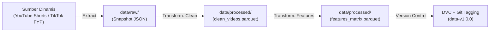

# MLOps-ViralSense 🚀

**ViralSense** adalah platform MLOps *end-to-end* yang dirancang untuk mendeteksi tren dan memprediksi video pendek (*YouTube Shorts & TikTok*) yang berpotensi viral guna membantu admin sosial media dan *content creator* menghasilkan ide konten dan video promosi yang efektif.

---

## 🏗️ Arsitektur Pipeline Data Dinamis

Data dikumpulkan secara berkala melalui pipeline ETL otomatis, dibersihkan, diekstraksi fiturnya, dan dilacak versinya menggunakan DVC sebelum dikonsumsi oleh model machine learning.



Dokumentasi rancangan teknis lengkap dapat dibaca di **[docs/data_pipeline_architecture.md](docs/data_pipeline_architecture.md)**.

---

## 📁 Struktur Repositori

```text
MLOps-ViralSense/
├── config/
│   └── config.yaml             # Konfigurasi pipeline data, sumber, dan parameter
├── data/                       # Penyimpanan data multi-tahap (dilacak DVC)
│   ├── raw/                    # Snapshot data mentah append-only per platform
│   │   ├── youtube/            # Snapshot YouTube Shorts (trending chart & broad search)
│   │   └── tiktok/             # Snapshot TikTok FYP/Trending feed publik
│   └── processed/              # Data bersih & matriks fitur (Parquet)
├── docs/
│   └── data_pipeline_architecture.md # Dokumen teknis spesifikasi pipeline ETL & DVC
├── src/
│   ├── data/
│   │   ├── ingest_youtube.py   # Modul ekstraksi YouTube Shorts (broad viral & trending)
│   │   ├── ingest_tiktok.py    # Modul ekstraksi TikTok (broad FYP/trending feed)
│   │   └── clean.py            # Modul pembersihan, deduplikasi, dan validasi
│   └── features/
│       └── build_features.py   # Rekayasa fitur (velocity, engagement, label viral)
├── .env.example                # Template variabel lingkungan
└── requirements.txt            # Dependensi proyek Python
```

---

## ⚡ Panduan Menjalankan Pipeline ETL

1. **Persiapan Lingkungan**:
   ```bash
   cp .env.example .env
   pip install -r requirements.txt
   ```

2. **Jalankan Ingestion (Ekstraksi Data Mentah YouTube & TikTok)**:
   ```bash
   # Ekstraksi YouTube Shorts (Chart Tren & Broad Search)
   python src/data/ingest_youtube.py

   # Ekstraksi TikTok (Live FYP & Trending Feed)
   python src/data/ingest_tiktok.py
   ```

3. **Jalankan Cleaning (Pembersihan Data)**:
   ```bash
   python src/data/clean.py
   ```

4. **Jalankan Feature Engineering (Matriks Fitur)**:
   ```bash
   python src/features/build_features.py
   ```

---

## 🏷️ Rencana Versioning Data (DVC)

Dataset diberi label versi semantik (`v1.0.0`, `v1.1.0`) dan dilacak menggunakan DVC:
```bash
dvc add data/raw data/processed
git add data/raw.dvc data/processed.dvc .gitignore
git commit -m "feat(data): track snapshot dataset v1.0.0"
git tag -a "data-v1.0.0" -m "Snapshot dataset awal"
```