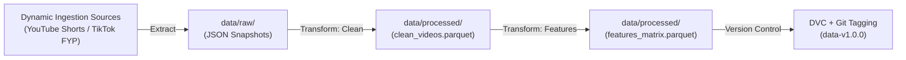

# ViralSense: Social Media Virality Prediction & Trend Saturation Detection Engine

[](https://www.python.org/downloads/release/python-3100/)
[](https://mlflow.org/)
[](https://github.com/features/codespaces)
[](https://opensource.org/licenses/MIT)

ViralSense is an end-to-end MLOps pipeline featuring continual learning capabilities, engineered to forecast early virality scores for short-form video content (YouTube Shorts & TikTok) and identify trend lifecycle stages (early-rise, peak, and saturated). The system addresses real-world constraints such as label latency, concept drift, and API quota limits through an automated, staged machine learning workflow.

---

## Key Objectives & Problem Domain

The lifecycle of short-form digital content is exceptionally brief, often decaying within days or a few weeks before reaching audience fatigue. ViralSense resolves this bottleneck by:
* Predicting content virality early via interaction growth rates (views, likes, comments, shares).
* Classifying trend phases using the slope of virality scores over time.
* Mitigating label latency by isolating immature observations from final evaluation datasets during a 3–7 day maturation window.
* Monitoring covariate shift and concept drift to trigger adaptive model retraining.
* Assisting content creators and digital marketing teams in discovering emerging viral opportunities and optimizing promotional content strategies.

---

## Data Pipeline Architecture

Data is ingested periodically via an automated ETL pipeline, cleaned, feature-engineered, and versioned using DVC prior to consumption by machine learning models.


```mermaid
flowchart LR
    A["Dynamic Ingestion Sources<br/>(YouTube Shorts / TikTok FYP)"] -->|Extract| B["data/raw/<br/>(JSON Snapshots)"]
    B -->|Transform: Clean| C["data/processed/<br/>(clean_videos.parquet)"]
    C -->|Transform: Features| D["data/processed/<br/>(features_matrix.parquet)"]
    D -->|Version Control| E["DVC + Git Tagging<br/>(data-v1.0.0)"]
```

For complete technical specifications and architectural design, refer to **[docs/data_pipeline_architecture.md](docs/data_pipeline_architecture.md)**.

---

## Directory Structure

This repository adheres to the **Cookiecutter Data Science** standard:

```text
├── .devcontainer/         # GitHub Codespaces container setup and reproducibility config
├── config/                # Pipeline parameter files (config.yaml)
├── data/
│   ├── external/          # Auxiliary trend signals (Google Trends, TikTok trends)
│   ├── processed/         # Cleaned, feature-engineered datasets (Parquet)
│   └── raw/               # Raw batch snapshots extracted from APIs and feeds
│       ├── tiktok/        # TikTok public FYP snapshots
│       └── youtube/       # YouTube Shorts snapshots
├── docs/                  # Technical design and architecture documentation
├── models/                # Serialized model artifacts and experiment weights
├── notebooks/             # Exploratory Data Analysis (EDA) and prototype notebooks
├── src/                   # Production-grade source code
│   ├── __init__.py
│   ├── ingest_data.py     # Unified dynamic data ingestion & periodic simulation script
│   ├── preprocess.py      # Automated preprocessing (tokenization, stopwords, missing values)
│   ├── data/              # Modular data extraction and validation modules
│   │   ├── clean.py       # Data cleaning, deduplication, and schema validation
│   │   ├── ingest_tiktok.py  # TikTok live FYP and trending ingestion
│   │   └── ingest_youtube.py # YouTube Data API v3 and trending ingestion
│   ├── features/          # Tabular metric computation and text vectorization
│   │   └── build_features.py # Velocity, engagement rates, and label generation
│   └── models/            # Staged regression and classification pipelines
├── .env.example           # Template for environment variables and API keys
├── .gitignore             # Standard Python/ML git ignore configuration
├── LICENSE                # Project license (MIT)
├── requirements.txt       # Core project dependencies
└── README.md              # Project documentation
```

---

## Pipeline Execution Guide

### 1. Environment Setup
Install project dependencies and configure environment variables:
```bash
cp .env.example .env
pip install -r requirements.txt
```

### 2. Data Ingestion (Dynamic & Continual Learning Ready)
Dynamic data extraction is orchestrated using `src/ingest_data.py`. This module pulls short-form content from **YouTube Shorts** and **TikTok FYP**, providing a non-destructive periodic simulation mechanism (*append-only timestamped snapshots*) to support **Continual Learning**.

```bash
# 1. Execute a single ingestion run across all platforms (YouTube Shorts & TikTok)
python src/ingest_data.py --source all

# 2. Execute ingestion for a specific platform
python src/ingest_data.py --source youtube
python src/ingest_data.py --source tiktok

# 3. Periodic simulation (Continual Learning: e.g., 3 cycles with a 5-second interval)
# Each cycle generates a distinct timestamped JSON snapshot without overwriting historical batches
python src/ingest_data.py --source all --runs 3 --interval 5
```

**Raw Snapshot Storage Layout:**
* `data/raw/youtube/{YYYY-MM-DD}/youtube_trending_{HHMMSS}.json`
* `data/raw/tiktok/{YYYY-MM-DD}/tiktok_trending_{HHMMSS}.json`
* `data/raw/sample_raw_videos.csv` (consolidated sample snapshot in tabular CSV format)

### 3. Automated Preprocessing & NLP Cleaning
Raw data preprocessing is automated via `src/preprocess.py` to cleanse and prepare snapshots prior to feature extraction:

```bash
python src/preprocess.py
```

**Preprocessing Workflow:**
1. **Snapshot Aggregation**: Recursively ingests all historical snapshot batches from `data/raw/`.
2. **Missing Value Imputation**: Imputes numeric interaction metrics (`views`, `likes`, `comments`, `shares`) with `0` and trims whitespace on textual features.
3. **Composite Deduplication**: Eliminates duplicate entries based on `(platform, video_id)`, retaining the latest interaction snapshot.
4. **Short-Form Content Validation**: Filters and retains video content with duration $\le 60$ seconds.
5. **Text Sanitization & Hashtag Extraction**: Strips URLs, removes `@user` mentions, and parses hashtags into `extracted_hashtags`.
6. **Tokenization**: Splits clean sentences into word tokens populated in the `tokens` column.
7. **Stopword Removal**: Eliminates common Indonesian and English stopwords in-memory without external download dependencies, populating `clean_tokens` and `clean_text_final`.
8. **Dual-Format Export**: Persists clean data to `data/processed/clean_videos.parquet` (optimized for ML training) and `data/processed/clean_videos.csv` (human-readable inspection).

### 4. Feature Engineering
Compute velocity metrics (views/hour, likes/hour), engagement ratios, content signals, and virality ground-truth labels:
```bash
python src/features/build_features.py
```

### 5. Automated Pipeline Unit Testing
Execute the test suite to validate data schemas, missing value resilience, duration filtering, tokenization, and stopword removal:
```bash
python -m unittest tests/test_data_pipeline.py
```

---

## Data Versioning Strategy (DVC)

Dataset releases follow semantic versioning (`v1.0.0`, `v1.1.0`) and are tracked using Data Version Control (DVC) to keep the Git repository lightweight:

```bash
# Track raw snapshots and processed datasets with DVC
dvc add data/raw data/processed

# Track DVC pointer files in Git
git add data/raw.dvc data/processed.dvc .gitignore
git commit -m "feat(data): track snapshot dataset v1.0.0"
git tag -a "data-v1.0.0" -m "Snapshot dataset release v1.0.0"
```

---

## License

This project is licensed under the MIT License - see the [LICENSE](LICENSE) file for details.
