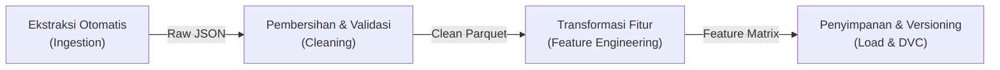
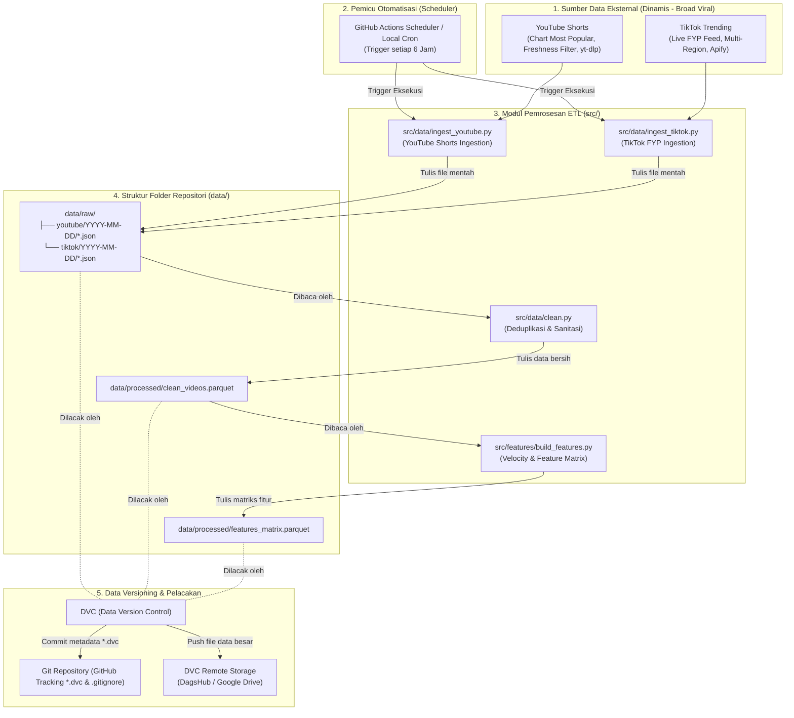

# Arsitektur Pipeline Data: ViralSense (MLOps)

Dokumen ini menyajikan rencana teknis menyeluruh mengenai bagaimana data mengalir dalam sistem **ViralSense** (platform *insight* dan prediksi video pendek viral). Perancangan ini berfokus pada mekanisme perolehan data dinamis, pemrosesan otomatis melalui *pipeline* ETL (Extract, Transform, Load), visualisasi aliran data ke folder `data/` di repositori, serta rencana pelabelan versi data (*data versioning*) berbasis DVC.

---

## 1. Identifikasi Sumber Data Dinamis

Untuk mendeteksi tren dan memprediksi viralitas video pendek secara akurat, sistem memerlukan data yang **terus bergerak (dinamis)** dan diambil secara berkala. ViralSense mengintegrasikan dua platform video pendek utama dengan strategi penemuan luas (*broad viral discovery*) tanpa mengikat pada akun personal tertentu:

| Sumber Data | Metode Pengambilan | Mekanisme Polling | Entitas / Atribut Data yang Diambil |
| :--- | :--- | :--- | :--- |
| **YouTube Shorts** | YouTube Data API v3 (Chart Most Popular & Viral Query) + `yt-dlp` Flat Search | Terjadwal setiap 4–6 jam berdasarkan chart trending regional (ID) serta *search queries* viral (`#shorts`, `#trending`, `#fyp`, dsb.) dengan filter waktu rilis 24–48 jam. | `video_id`, `channel_id`, `channel_name`, `title`, `description`, `published_at`, `duration_seconds`, `view_count`, `like_count`, `comment_count`, `tags`. |
| **TikTok Videos** | Feed Rekomendasi FYP Publik (Multi-region) + Opsi Tagar Apify | Terjadwal setiap 6 jam berdasarkan stream feed rekomendasi langsung (FYP) dan tagar viral (`#fyp`, `#viral`, `#racuntiktok`, `#trending`, dsb.). | `video_id`, `channel_id`, `channel_name`, `title`, `description`, `published_at`, `duration_seconds`, `view_count`, `like_count`, `comment_count`, `share_count`, `tags`. |

### Karakteristik & Dinamika Data
1. **Sifat Data Snapshot**: Setiap video yang sama diekstrak kembali pada interval waktu berikutnya ($t_1, t_2, t_3$) untuk mencatat perubahan laju pertumbuhan metrik ($\Delta\text{views}, \Delta\text{likes}, \Delta\text{comments}$).
2. **Kepatuhan Kuota & Anti-Blokir**:
   * YouTube API menggunakan kuota gratis resmi 10.000 unit/hari (didukung fallback `yt-dlp` tanpa batasan kuota API).
   * Scraper TikTok menggunakan rotasi *User-Agent*, jeda wajar, dan dukungan multi-region agar tidak terkena *rate-limiting* / IP blocking.

---

## 2. Desain Pipeline ETL (Extract, Transform, Load)

Alur ETL dirancang secara modular agar setiap tahap terisolasi, mudah diuji, dan dapat direproduksi (*reproducible*).



### A. Mekanisme Pengambilan Data Otomatis (Ingestion / Extract)
* **Modul**: [`src/data/ingest_youtube.py`](file:///workspaces/MLOps-ViralSense/src/data/ingest_youtube.py), [`src/data/ingest_tiktok.py`](file:///workspaces/MLOps-ViralSense/src/data/ingest_tiktok.py).
* **Eksekusi Otomatis**: Pipeline dijalankan secara terjadwal menggunakan GitHub Actions Cron (atau cron runner lokal/Airflow).
* **Penyimpanan Append-Only**:
  * Setiap eksekusi menghasilkan file snapshot baru tanpa menimpa (*overwrite*) data sebelumnya.
  * Lokasi: `data/raw/{platform}/{YYYY-MM-DD}/{platform}_trending_{HHMMSS}.json`.
  * Metadata pencatatan: Disertakan kolom `ingested_at` (timestamp pengambilan) dan `data_source_type`.

### B. Tahapan Pembersihan Data (Cleaning / Transform - Bagian 1)
* **Modul**: [`src/data/clean.py`](file:///workspaces/MLOps-ViralSense/src/data/clean.py)
* **Langkah-langkah Pembersihan**:
  1. **Deduplikasi**:
     * Mengidentifikasi duplikasi record berdasarkan pasangan unik `(platform, video_id)`.
  2. **Filter Validitas Format Video Pendek**:
     * Memfilter video dengan durasi $> 60$ detik (menjaga fokus dataset hanya pada format video pendek / *Shorts / TikTok*).
     * Memfilter video berstatus privat, dihapus, atau tidak memiliki metrik dasar.
  3. **Penanganan Nilai Hilang (*Missing Values*)**:
     * Nilai numerik seperti `like_count`, `comment_count`, `share_count` yang bernilai `null` diimputasi dengan nilai `0`.
     * Kolom teks (`title`, `description`) yang kosong diisi dengan string kosong `""`.
  4. **Pembersihan Teks (*Text Preprocessing*)**:
     * Menghapus karakter *broken encoding*, mereduksi spasi ganda, dan mengekstrak daftar hashtag ke dalam format list terstruktur.
* **Output Tahap Ini**: `data/processed/clean_videos.parquet`.

### C. Transformasi Fitur (Feature Engineering / Transform - Bagian 2)
* **Modul**: [`src/features/build_features.py`](file:///workspaces/MLOps-ViralSense/src/features/build_features.py)
* **Fitur-fitur Kunci yang Dibentuk**:
  1. **Fitur Kecepatan & Momentum (*Velocity Metrics*)**:
     $$\text{video\_age\_hours} = \max\left(\frac{\text{ingested\_at} - \text{published\_at}}{3600}, 0.1\right)$$
     $$\text{views\_velocity} = \frac{\text{view\_count}}{\text{video\_age\_hours}}$$
     $$\text{likes\_velocity} = \frac{\text{like\_count}}{\text{video\_age\_hours}}$$
  2. **Rasio Keterlibatan (*Engagement Rates*)**:
     $$\text{engagement\_rate} = \frac{\text{like\_count} + 2 \times \text{comment\_count}}{\max(\text{view\_count}, 1)}$$
     $$\text{comment\_ratio} = \frac{\text{comment\_count}}{\max(\text{like\_count}, 1)}$$
  3. **Fitur Sinyal Konten & Hook (NLP Dasar)**:
     * `caption_length`: Panjang karakter teks judul dan deskripsi.
     * `word_count`: Jumlah kata dalam teks.
     * `has_hook_question`: Nilai biner ($1$ jika ada tanda tanya `?`, $0$ jika tidak).
  4. **Pelabelan Target (*Ground Truth Virality*)**:
     * Menentukan label biner `is_viral`:
       $$\text{is\_viral} = \begin{cases} 1, & \text{jika } \text{views\_velocity} \ge \text{Persentil ke-90 dalam batch} \\ 0, & \text{lainnya} \end{cases}$$
* **Output Tahap Ini**: `data/processed/features_matrix.parquet`.

---

## 3. Visualisasi Arsitektur Pipeline Data

Diagram berikut memvisualisasikan bagaimana data dari sumber eksternal masuk ke dalam repositori GitHub dan dikelola oleh struktur folder `data/`:



---

## 4. Rencana Versioning Data (Persiapan Implementasi DVC)

File data mentah (*raw JSON*) dan matriks fitur (*processed parquet*) berukuran besar dan terus bertambah, sehingga **tidak boleh disimpan secara langsung di dalam Git commit** agar ukuran repositori tetap ringan.

### A. Strategi Pelabelan Versi (Versioning Scheme)
ViralSense menerapkan kombinasi **Semantic Versioning** dan **Timestamp Snapshot**:

* **Format Versi**: `v<Major>.<Minor>.<Patch>`
  * **Major (`v1.0.0` -> `v2.0.0`)**: Perubahan struktur data secara radikal (contoh: restrukturisasi kolom target, penambahan platform baru, atau perubahan format dari JSON ke format biner lain).
  * **Minor (`v1.0.0` -> `v1.1.0`)**: Penambahan batch data berkala dalam jumlah signifikan (misalnya akumulasi scraping mingguan/dua mingguan).
  * **Patch (`v1.1.0` -> `v1.1.1`)**: Perbaikan minor pada pembersihan data atau pembaruan anotasi data tanpa penambahan volume masif.

### B. Standard Operating Procedure (SOP) DVC

1. **Inisialisasi DVC (Pekan Berikutnya)**:
   ```bash
   dvc init
   dvc remote add -d storage s3://my-dagshub-bucket/data   # atau remote gdrive
   git add .dvc .dvcignore
   git commit -m "chore: inisialisasi DVC remote storage"
   ```

2. **Pelacakan Folder Data**:
   ```bash
   # Melacak direktori data dengan DVC
   dvc add data/raw data/processed

   # Git otomatis mengabaikan file fisik di data/ dan hanya melacak pointer .dvc
   git add data/raw.dvc data/processed.dvc data/.gitignore
   git commit -m "feat(data): perbarui snapshot dataset v1.0.0"
   ```

3. **Pemberian Tag pada Git (Menghubungkan Versi Kode & Data)**:
   ```bash
   git tag -a "data-v1.0.0" -m "Snapshot dataset awal: video Shorts & TikTok"
   ```

4. **Sinkronisasi Data ke Remote Storage**:
   ```bash
   # Mengunggah file biner data ke storage cloud (DagsHub / Google Drive)
   dvc push
   
   # Mendorong commit dan tag Git ke GitHub
   git push origin main --tags
   ```

5. **Reproduksibilitas Tim / CI Pipeline**:
   Setiap developer atau sistem CI/CD yang ingin mereproduksi data pada versi tertentu cukup menjalankan:
   ```bash
   git checkout data-v1.0.0
   dvc pull
   ```
   Perintah ini akan langsung mengunduh file data yang tepat dan identik sesuai versi tag tersebut.
