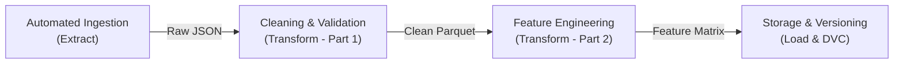
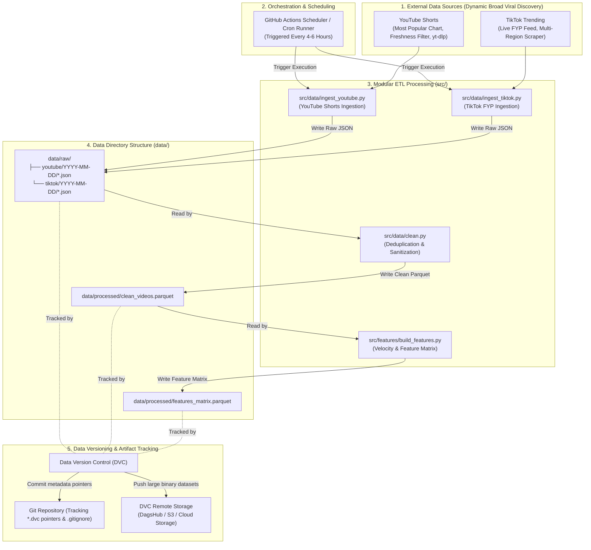

# Data Pipeline Architecture: ViralSense (MLOps)

This document provides a comprehensive technical specification of data flows within the **ViralSense** platform—an MLOps engine for short-form viral video insights and trend forecasting. The design emphasizes dynamic data ingestion mechanisms, automated processing through modular ETL (Extract, Transform, Load) pipelines, structured data organization in the repository's `data/` directory, and a robust Data Version Control (DVC) strategy.

---

## 1. Dynamic Data Source Identification

Accurate trend detection and virality prediction require continuous, dynamic data ingestion sampled at regular intervals. ViralSense integrates two primary short-form video platforms using a broad viral discovery strategy that avoids coupling to specific personal accounts:

| Data Source | Ingestion Method | Polling Frequency | Extracted Attributes & Schema |
| :--- | :--- | :--- | :--- |
| **YouTube Shorts** | YouTube Data API v3 (Most Popular charts & viral query search) with `yt-dlp` fallback | Scheduled every 4–6 hours based on regional trending charts (ID) and viral search queries (`#shorts`, `#trending`, `#fyp`, etc.) with a 24–48 hour freshness filter. | `video_id`, `channel_id`, `channel_name`, `title`, `description`, `published_at`, `duration_seconds`, `view_count`, `like_count`, `comment_count`, `tags`. |
| **TikTok Videos** | Public Recommendation Feed (FYP) & Apify hashtag scrapers | Scheduled every 6 hours based on live recommendation streams (FYP) and trending hashtags (`#fyp`, `#viral`, `#trending`, etc.). | `video_id`, `channel_id`, `channel_name`, `title`, `description`, `published_at`, `duration_seconds`, `view_count`, `like_count`, `comment_count`, `share_count`, `tags`. |

### Data Dynamics and Operational Constraints
1. **Snapshot-Based Tracking**: Identical videos are re-extracted across successive time intervals ($t_1, t_2, t_3$) to track differential growth rates ($\Delta\text{views}, \Delta\text{likes}, \Delta\text{comments}$).
2. **API Quota Management & Anti-Blocking Policies**:
   * The YouTube Data API v3 is utilized within the official free tier quota (10,000 units/day), supplemented by `yt-dlp` flat search as a quota-free fallback.
   * TikTok extraction enforces User-Agent rotation, adaptive request delays, and multi-region proxies to prevent rate-limiting and IP blocks.

---

## 2. ETL Pipeline Design (Extract, Transform, Load)

The ETL workflow is designed with modular stages to ensure complete isolation, reproducibility, and unit testability.



### A. Automated Ingestion Mechanism (Extract)
* **Modules**: [`src/data/ingest_youtube.py`](../src/data/ingest_youtube.py), [`src/data/ingest_tiktok.py`](../src/data/ingest_tiktok.py).
* **Automated Scheduling**: Executed via scheduled GitHub Actions cron jobs (or local cron runners / Apache Airflow).
* **Append-Only Snapshot Storage**:
  * Every execution writes a new timestamped snapshot without overwriting historical batches.
  * Destination: `data/raw/{platform}/{YYYY-MM-DD}/{platform}_trending_{HHMMSS}.json`.
  * Audit Metadata: Each record includes an `ingested_at` ISO timestamp and `data_source_type` indicator.

### B. Data Cleaning and Preprocessing (Transform - Part 1)
* **Module**: [`src/data/clean.py`](../src/data/clean.py)
* **Processing Steps**:
  1. **Deduplication**:
     * Deduplicate entries based on the composite unique key `(platform, video_id)`.
  2. **Short-Form Content Validation**:
     * Filter out videos with duration $> 60$ seconds to maintain focus strictly on short-form formats.
     * Eliminate private, deleted, or incomplete records lacking baseline engagement metrics.
  3. **Missing Value Imputation**:
     * Missing numerical counts (`like_count`, `comment_count`, `share_count`) are imputed with `0`.
     * Missing textual values (`title`, `description`) are defaulted to empty strings `""`.
  4. **Text Sanitization**:
     * Strip invalid character encodings, normalize multiple spaces, and parse hashtags into structured list formats.
* **Stage Output**: `data/processed/clean_videos.parquet`.

### C. Feature Engineering (Transform - Part 2)
* **Module**: [`src/features/build_features.py`](../src/features/build_features.py)
* **Engineered Feature Sets**:
  1. **Velocity and Momentum Metrics**:
     $$\text{video\_age\_hours} = \max\left(\frac{\text{ingested\_at} - \text{published\_at}}{3600}, 0.1\right)$$
     $$\text{views\_velocity} = \frac{\text{view\_count}}{\text{video\_age\_hours}}$$
     $$\text{likes\_velocity} = \frac{\text{like\_count}}{\text{video\_age\_hours}}$$
  2. **Engagement Ratios**:
     $$\text{engagement\_rate} = \frac{\text{like\_count} + 2 \times \text{comment\_count}}{\max(\text{view\_count}, 1)}$$
     $$\text{comment\_ratio} = \frac{\text{comment\_count}}{\max(\text{like\_count}, 1)}$$
  3. **Content and Hook Signals (NLP Heuristics)**:
     * `caption_length`: Character length of title and description.
     * `word_count`: Word count of content text.
     * `has_hook_question`: Binary flag ($1$ if question mark `?` is present, $0$ otherwise).
  4. **Target Ground-Truth Labeling**:
     * Assign binary virality label `is_viral`:
       $$\text{is\_viral} = \begin{cases} 1, & \text{if } \text{views\_velocity} \ge \text{90th percentile of current batch} \\ 0, & \text{otherwise} \end{cases}$$
* **Stage Output**: `data/processed/features_matrix.parquet`.

---

## 3. Data Pipeline Architecture Diagram

The diagram below illustrates how data transitions from external sources into repository structures and DVC-managed storage:



---

## 4. Data Versioning Strategy (DVC Implementation)

Raw JSON snapshots and processed feature matrices increase rapidly over time. Storing these large binary files directly within Git commits degrades repository performance and inflates commit history. Data Version Control (DVC) decouples large dataset storage from source code version tracking.

### A. Versioning Scheme
ViralSense implements semantic dataset versioning coupled with timestamped snapshot logging:

* **Version Format**: `v<Major>.<Minor>.<Patch>`
  * **Major (`v1.0.0` -> `v2.0.0`)**: Breaking schema changes, structural feature shifts, target definition modifications, or platform additions.
  * **Minor (`v1.0.0` -> `v1.1.0`)**: Significant batch additions and scheduled dataset updates (e.g., bi-weekly or monthly aggregations).
  * **Patch (`v1.1.0` -> `v1.1.1`)**: Data cleaning refinements, anomaly re-labeling, or metadata correction without dataset expansion.

### B. DVC Standard Operating Procedure (SOP)

1. **DVC Initialization & Remote Storage Setup**:
   ```bash
   dvc init
   dvc remote add -d storage s3://my-storage-bucket/data   # or DagsHub / Google Drive
   git add .dvc .dvcignore
   git commit -m "chore: initialize DVC remote storage"
   ```

2. **Tracking Data Directories**:
   ```bash
   # Track data directories with DVC
   dvc add data/raw data/processed

   # Git ignores physical binaries and tracks .dvc pointer files
   git add data/raw.dvc data/processed.dvc data/.gitignore
   git commit -m "feat(data): track dataset snapshot v1.0.0"
   ```

3. **Git Tagging (Linking Code and Data Versions)**:
   ```bash
   git tag -a "data-v1.0.0" -m "Initial dataset snapshot release: Shorts & TikTok"
   ```

4. **Synchronizing Data to Remote Storage**:
   ```bash
   # Push binary datasets to remote cloud storage
   dvc push

   # Push Git commits and semantic release tags
   git push origin main --tags
   ```

5. **Reproducibility & CI/CD Pipeline Integration**:
   Any collaborator or automated CI/CD pipeline can reconstruct the exact dataset snapshot corresponding to a specific commit or tag:
   ```bash
   git checkout data-v1.0.0
   dvc pull
   ```
